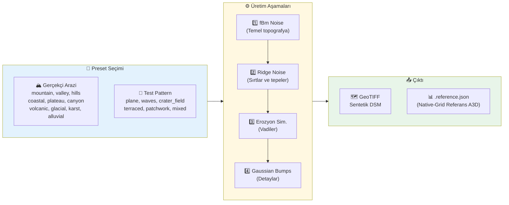

<p align="center">
  
</p>

<h1 align="center">DEM 3D Yüzey Alanı Hesaplama Aracı</h1>

<p align="center">
  <strong>DEM/DSM GeoTIFF verilerinden 3D yüzey alanı (A3D) hesaplama için kapsamlı Python kütüphanesi</strong>
</p>

<p align="center">
  <a href="https://www.python.org/"></a>
  <a href="#lisans"></a>
  <a href="#"></a>
</p>

<p align="center">
  <a href="#-hızlı-başlangıç">Hızlı Başlangıç</a> •
  <a href="#-özellikler">Özellikler</a> •
  <a href="#-kurulum">Kurulum</a> •
  <a href="#-kullanım">Kullanım</a> •
  <a href="#-yöntemler">Yöntemler</a> •
  <a href="#-çıktılar">Çıktılar</a>
</p>

---

## 📋 İçindekiler

- [🚀 Hızlı Başlangıç](#-hızlı-başlangıç)
- [✨ Özellikler](#-özellikler)
- [🔄 İş Akışı](#-iş-akışı)
- [📦 Kurulum](#-kurulum)
  - [Gereksinimler](#gereksinimler)
  - [Adım Adım Kurulum](#adım-adım-kurulum)
  - [Bağımlılıklar](#bağımlılıklar)
  - [Kurulum Sorun Giderme](#kurulum-sorun-giderme)
- [💻 Kullanım](#-kullanım)
  - [IDE Üzerinden](#yöntem-1-ide-üzerinden-önerilen)
  - [Komut Satırı](#yöntem-2-komut-satırı-argümanları)
  - [Sentetik DSM](#sentetik-dsm-metot-kıyaslama)
  - [VS Code ile Çalıştırma](#yöntem-3-vs-code-ile-çalıştırma)
- [⚙️ Parametreler](#️-parametreler)
  - [Zorunlu Parametreler](#zorunlu-parametreler)
  - [İsteğe Bağlı Parametreler](#isteğe-bağlı-parametreler)
  - [Parametre Detayları](#parametre-detayları)
- [🔬 Yöntemler](#-yöntemler)
- [📊 Çıktılar](#-çıktılar)
- [🛠️ Teknik Detaylar](#️-teknik-detaylar)
- [🧪 Testler](#-testler)
- [⚡ Performans İpuçları](#-performans-ipuçları)
- [📚 Kaynaklar](#-kaynaklar)
- [📄 Lisans](#-lisans)

---

## 🚀 Hızlı Başlangıç

En basit kullanım için:

```bash
# 1. Repository'yi klonlayın
git clone <repo-url>
cd yuzey_alani_hesaplama

# 2. Bağımlılıkları yükleyin
pip install -r requirements.txt

# 3. DEM dosyanızı proje dizinine kopyalayın ve çalıştırın
python main.py run --dem dem_dosyam.tif --outdir sonuclar
```

Veya `main.py` içindeki `DEFAULT_RUN_CONFIG`'i düzenleyerek:

```bash
python main.py
```

---

## ✨ Özellikler

<table>
<tr>
<td width="50%">

### 🎯 Hesaplama
- **6 farklı algoritma** ile yüzey alanı hesaplama
- **Çoklu çözünürlük analizi** (GSD desteği)
- **Multiscale ayrıştırma** (topoğrafik + mikro)
- **ROI/Parsel desteği** (GeoJSON/Shapefile)

</td>
<td width="50%">

### 📈 Çıktılar
- **CSV** formatında sonuçlar (long + wide format)
- **JSON** metadata ve run bilgisi
- **PNG** grafikler (A3D vs GSD, ratio vb.)
- **Ground truth** referans değerler

</td>
</tr>
<tr>
<td>

### ⚡ Performans
- **Blok işleme** ile büyük dosya desteği (`rasterio.block_windows`)
- **Bellek-etkin** raster işleme
- **Nodata yönetimi** ve kenar hücre kontrolü

</td>
<td>

### 🛠️ Sentetik DSM Üretimi
- **16 farklı preset** (10 gerçekçi arazi + 6 test pattern)
- **fBm noise** tabanlı gerçekçi arazi üretimi
- **Erozyon simülasyonu** (hidrolik + termal)
- **Ground truth** referans alan hesaplama

</td>
</tr>
</table>

---

## 🔄 İş Akışı

### Ana İşlem Akışı


### Sentetik DSM Üretim Akışı



---

## 📦 Kurulum

### Gereksinimler

| Gereksinim | Minimum | Önerilen |
|:----------:|:-------:|:--------:|
| 🐍 **Python** | 3.10 | 3.12 |
| 💾 **RAM** | 4 GB | 8+ GB (büyük DEM'ler için) |
| 💿 **Disk** | 100 MB | Veri boyutuna bağlı |
| 🖥️ **İşletim Sistemi** | Windows 10, Linux (Ubuntu 20.04+), macOS 11+ | - |

### Adım Adım Kurulum

#### 1️⃣ Repository'yi Klonlayın

```bash
git clone <repo-url>
cd yuzey_alani_hesaplama
```

#### 2️⃣ Sanal Ortam Oluşturun (Önerilir)

**🪟 Windows (PowerShell):**
```powershell
# Sanal ortam oluştur
python -m venv .venv

# Sanal ortamı etkinleştir
.venv\Scripts\Activate.ps1

# Not: ExecutionPolicy hatası alırsanız önce şunu çalıştırın:
# Set-ExecutionPolicy -ExecutionPolicy RemoteSigned -Scope CurrentUser
```

**🪟 Windows (CMD):**
```cmd
python -m venv .venv
.venv\Scripts\activate.bat
```

**🐧 Linux / macOS:**
```bash
python3 -m venv .venv
source .venv/bin/activate
```

#### 3️⃣ Bağımlılıkları Yükleyin

```bash
pip install --upgrade pip
pip install -r requirements.txt
```

#### 4️⃣ Kurulumu Doğrulayın

```bash
# Versiyon kontrolü
python -c "import surface_area; print(f'surface_area v{surface_area.__version__}')"

# Yardım mesajını görüntüle
python main.py --help
```

### Bağımlılıklar

`requirements.txt` dosyasında tanımlı ana bağımlılıklar:

| Paket | Amaç | Açıklama |
|:-----:|:-----|:---------|
| `numpy` | Sayısal hesaplamalar | Array işlemleri, matematiksel fonksiyonlar |
| `rasterio` | GeoTIFF I/O | Raster okuma/yazma, CRS işlemleri |
| `scipy` | Bilimsel hesaplamalar | Gaussian filtre, erozyon simülasyonu |
| `pandas` | Veri işleme | DataFrame, CSV export |
| `matplotlib` | Grafikler | PNG çıktı üretimi |
| `shapely` | Geometri işlemleri | ROI/polygon kesişimleri |
| `pytest` | Test çerçevesi | Geliştirme için |

**Manuel kurulum (requirements.txt olmadan):**
```bash
pip install numpy rasterio scipy pandas matplotlib pytest shapely
```

> 💡 **Not (ROI Shapefile):** Shapefile/OGR formatları için `geopandas` veya `fiona` gerekir. GeoJSON için yalnızca `shapely` yeterlidir.

### Kurulum Sorun Giderme

#### 🔴 Windows'ta rasterio Kurulum Hatası

Rasterio, GDAL kütüphanesine bağımlıdır. Windows'ta sorun yaşarsanız:

```powershell
# Conda ile kurulum (önerilir)
conda install -c conda-forge rasterio

# veya wheel dosyasından kurulum
pip install --find-links=https://github.com/cgohlke/geospatial-wheels/releases rasterio
```

#### 🔴 Permission Hatası (Linux/macOS)

```bash
# --user flag'i ile kur
pip install --user -r requirements.txt

# veya sudo ile (önerilmez)
sudo pip install -r requirements.txt
```

#### 🔴 SSL/Network Hatası

```bash
# Trusted host ekleyerek kur
pip install --trusted-host pypi.org --trusted-host files.pythonhosted.org -r requirements.txt
```

---

## 💻 Kullanım

### Yöntem 1: IDE Üzerinden (Önerilen)

`main.py` dosyasındaki `DEFAULT_RUN_CONFIG` alanını düzenleyerek parametreleri tek bir yerden yönetebilirsiniz:

```python
DEFAULT_RUN_CONFIG = RunConfig(
    dem="vadi_dsm.tif",           # Girdi DEM dosyası
    outdir="out_vadi",            # Çıktı klasörü
    gsd=[0.5, 1, 2, 5, 10],       # Hedef çözünürlükler
    methods=["gradient_multiplier"],  # Kullanılacak yöntemler
    plots=True,                   # Grafik üret
)
```

Ardından:

```bash
python main.py
```

### Yöntem 2: Komut Satırı Argümanları

```bash
python main.py run \
  --dem dag_dsm.tif \
  --outdir out \
  --gsd 0.5 1 2 5 10 \
  --methods gradient_multiplier tin_2tri_cell \
  --plots
```

### Sentetik DSM (Metot Kıyaslama)

Yöntemleri gerçek DEM'lere geçmeden önce **kontrollü** yüzeyler üzerinde doğrulamak/kıyaslamak için sentetik DSM/DEM üretebilirsiniz. İki üretim yolu vardır:

1. **Hızlı üretim (CLI):** `python -m surface_area synth ...` sadece GeoTIFF üretir.
2. **Benchmark / native-grid referans:** `generate_synthetic_tif.py` GeoTIFF + **native çözünürlükte** referans A2D/A3D hesaplar ve `.reference.json` üretir.

#### 1️⃣ Hızlı Üretim: `surface_area synth`

```bash
# 1) Sentetik DSM üret (patchwork = farklı desenlerin karışımı)
python -m surface_area synth \
  --out synthetic_patchwork.tif \
  --preset patchwork \
  --rows 512 --cols 512 \
  --dx 1 --seed 0 \
  --nodata_holes 5

# 2) Metotları çalıştır
python -m surface_area run \
  --dem synthetic_patchwork.tif \
  --outdir out_synth \
  --gsd 1 2 5 10 \
  --methods jenness_window_8tri tin_2tri_cell gradient_multiplier bilinear_patch_integral adaptive_bilinear_patch_integral multiscale_decomposed_area \
  --plots
```

#### 2️⃣ Preset'ler

**🗺️ Gerçekçi Arazi Tipleri** (saha benzeri testler için):

| Preset | Açıklama |
|:------:|:---------|
| `mountain` | Dağlık arazi (fBm noise + sırtlar, erozyon) |
| `valley` | Vadi ve akarsu yatakları |
| `hills` | Yumuşak tepeler (rolling hills) |
| `coastal` | Kıyı şeridi (deniz-kara geçişi) |
| `plateau` | Yüksek plato ve yamaçlar |
| `canyon` | Kanyon/boğaz yapıları |
| `volcanic` | Volkanik arazi (kraterler, lav akışı) |
| `glacial` | Buzul vadisi (U-şekilli) |
| `karst` | Karstik arazi (düdenler, mağaralar) |
| `alluvial` | Alüvyal ova/delta |

**🔬 Test Patternleri** (analitik/doğrulama için):

| Preset | Açıklama |
|:------:|:---------|
| `plane` | Düz eğimli yüzey (z = ax + by + c) |
| `waves` | Sinüzoidal dalgalar |
| `crater_field` | Krater alanı |
| `terraced` | Teraslı arazi |
| `patchwork` | Karışık yüzeyler |
| `mixed` | Maksimum çeşitlilik |

#### 3️⃣ Önemli Parametreler

| Parametre | Açıklama |
|:---------:|:---------|
| `--dx`, `--dy` | Piksel boyutu (metre). Daha küçük değer = daha fazla detay + daha büyük dosya/bellek. |
| `--relief` | Makro rölyef çarpanı (yamaçları/zirveleri büyütür). |
| `--roughness_m` | Mikro pürüzlülük genliği (metre). Mikro-topografya etkisini artırır. |
| `--seed` | Tekrarlanabilirlik için sabit seed. |
| `--nodata_holes`, `--nodata_radius_m` | Nodata delikleri oluşturarak nodata/kenar davranışını test eder. |

#### 4️⃣ Native-Grid Referans Alan: `generate_synthetic_tif.py`

`generate_synthetic_tif.py`, aynı sentetik yüzeyi üretip **native çözünürlükte** referans A2D/A3D değerlerini hesaplar ve GeoTIFF'in yanına `.reference.json` yazar. `--out` parametresi `{preset}`, `{rows}`, `{cols}`, `{dx}`, `{seed}`, `{timestamp}` gibi şablonları da destekler.
> Not: Bu değer raster çözünürlüğüne bağlı bir kıyas referansıdır; analitik ground truth değildir.

```bash
# Sentetik DSM + native-grid referans alan
python generate_synthetic_tif.py \
  --out out_synth/synth_mountain_dx1_seed42.tif \
  --preset mountain \
  --rows 2048 --cols 2048 \
  --dx 1 --seed 42 \
  --nodata_holes 20

# Referans: out_synth/synth_mountain_dx1_seed42.reference.json
# İçerik: surface_area_m2, planar_area_m2, surface_ratio, valid_cells, nodata_cells

# Kıyas: gsd=1 ile çalıştırıp results_long.csv içindeki A3D'yi JSON'daki surface_area_m2 ile karşılaştırın.
python -m surface_area run \
  --dem out_synth/synth_mountain_dx1_seed42.tif \
  --outdir out_synth_run \
  --gsd 1 \
  --methods jenness_window_8tri tin_2tri_cell gradient_multiplier bilinear_patch_integral adaptive_bilinear_patch_integral \
  --plots
```

> 💡 **Not:** Aynı komutları `python main.py synth ...` / `python main.py run ...` şeklinde de kullanabilirsiniz.

### Yöntem 3: VS Code ile Çalıştırma

Bu repoda hazır **VS Code** çalıştırma ayarları bulunur:

1. `Run and Debug (Ctrl+Shift+D)` → **SurfaceArea: main.py** seçin
2. Python interpreter olarak `.venv` seçin (`Ctrl+Shift+P` → `Python: Select Interpreter`)
3. `F5` ile çalıştırın

Bağımlılıkları kurmak için: `Terminal → Run Task…` → **SurfaceArea: install deps (venv)**

### Yardım Mesajı

```bash
python main.py --help
```

---

## ⚙️ Parametreler

### Zorunlu Parametreler

| Parametre | Kısa | Tip | Açıklama |
|:---------:|:----:|:---:|:---------|
| `--dem` | - | `str` | Girdi DEM/DSM GeoTIFF dosya yolu. Mutlak veya göreli yol olabilir. |
| `--outdir` | - | `str` | Çıktı dizini. Mevcut değilse otomatik oluşturulur. |

**Örnek:**
```bash
python main.py run --dem C:\data\dem.tif --outdir C:\results
```

### İsteğe Bağlı Parametreler

| Parametre | Tip | Varsayılan | Açıklama |
|:---------:|:---:|:----------:|:---------|
| `--gsd` | `list[float]` | `0.1, 0.5, 1, 2, 5, 10, 20, 50` | Hedef GSD (Ground Sample Distance) değerleri metre cinsinden |
| `--methods` | `list[str]` | Tümü | Çalıştırılacak hesaplama yöntemleri |
| `--resampling` | `str` | `bilinear` | Yeniden örnekleme algoritması |
| `--nodata` | `float` | Otomatik | Nodata değeri (dataset'te tanımlı değilse) |
| `--slope_method` | `str` | `horn` | Gradient/eğim hesaplama kerneli |
| `--jenness_weight` | `float` | `0.25` | Jenness yöntemi ağırlık katsayısı |
| `--integral_N` | `int` | `5` | Bilinear integral alt bölme sayısı |
| `--adaptive_rel_tol` | `float` | `1e-4` | Adaptive bilinear bağıl tolerans |
| `--adaptive_abs_tol` | `float` | `0.0` | Adaptive bilinear mutlak tolerans |
| `--adaptive_max_level` | `int` | `5` | Adaptive bilinear maksimum inceltme seviyesi |
| `--adaptive_min_N` | `int` | `2` | Adaptive bilinear başlangıç N |
| `--adaptive_roughness_fastpath` | `bool` | Açık | Düz/planar patch fast-path |
| `--adaptive_roughness_threshold` | `float` | Otomatik | Fast-path eşiği (opsiyonel) |
| `--sigma_mode` | `str` | `mult` | Multiscale sigma yorumlama modu |
| `--sigma_m` | `list[float]` | `2.0, 5.0` | Multiscale sigma değerleri |
| `--roi` | `str` | - | ROI polygon yolu (GeoJSON veya Shapefile) |
| `--roi_id_field` | `str` | Otomatik | ROI id alanı |
| `--roi_mode` | `str` | `mask` | ROI modu: `mask` veya `fraction` |
| `--roi_all_touched` | `flag` | Kapalı | `mask` modunda all_touched rasterize |
| `--roi_only` | `flag` | Kapalı | Sadece ROI çıktısını üret |
| `--plots` | `flag` | Kapalı | PNG grafik üretimini etkinleştirir |
| `--keep_resampled` | `flag` | Kapalı | Resample edilmiş GeoTIFF'leri saklar |
| `--reference_csv` | `str` | - | Karşılaştırma için referans CSV dosyası |

### Parametre Detayları

#### 📏 `--gsd` (Ground Sample Distance)

Hedef çözünürlük değerlerini metre cinsinden belirler. Analiz, her GSD değeri için ayrı ayrı çalıştırılır.

| Değer | Açıklama | Kullanım Senaryosu |
|:-----:|:---------|:-------------------|
| `< 1` | Alt-metre çözünürlük | Mikro-topografya, detaylı yüzey analizi |
| `1-5` | Yüksek çözünürlük | Standart DEM analizi |
| `5-20` | Orta çözünürlük | Bölgesel analiz, hızlı sonuç |
| `> 20` | Düşük çözünürlük | Geniş alan analizi, trend görme |

```bash
# Çoklu GSD değeri (boşlukla ayrılmış)
--gsd 0.5 1 2 5 10

# Tek değer
--gsd 1
```

> ⚠️ **Dikkat:** Kaynak DEM'in çözünürlüğünden küçük GSD değerleri upsample yapar ve dosya boyutunu önemli ölçüde artırabilir.

---

#### 🔬 `--methods` (Hesaplama Yöntemleri)

Kullanılabilir yöntemler:

| Yöntem | Açıklama | Hız | Doğruluk |
|:-------|:---------|:---:|:--------:|
| `gradient_multiplier` | Gradient tabanlı alan çarpanı | ⚡⚡⚡ Çok hızlı | Yüksek |
| `tin_2tri_cell` | Her hücre 2 üçgen olarak modellenir | ⚡⚡ Hızlı | Yüksek |
| `jenness_window_8tri` | 3x3 pencerede 8 üçgen | ⚡⚡ Hızlı | Çok yüksek |
| `bilinear_patch_integral` | Bilinear yüzey integrasyonu | ⚡ Yavaş | En yüksek |
| `adaptive_bilinear_patch_integral` | Bilinear integral (adaptif inceltme) | ⚡ Yavaş | En yüksek |
| `multiscale_decomposed_area` | Çok ölçekli ayrıştırma | ⚡ Yavaş | Özel |

```bash
# Tek yöntem
--methods gradient_multiplier

# Çoklu yöntem
--methods gradient_multiplier tin_2tri_cell jenness_window_8tri

# Tüm yöntemler (belirtilmezse varsayılan)
# (--methods parametresini kullanmayın)
```

---

#### 🔄 `--resampling` (Yeniden Örnekleme)

DEM'i farklı çözünürlüklere dönüştürürken kullanılan interpolasyon yöntemi:

| Değer | Açıklama | Önerilen Kullanım |
|:-----:|:---------|:------------------|
| `bilinear` | Bilinear interpolasyon (4 komşu) | **Varsayılan**, çoğu durum için ideal |
| `nearest` | En yakın komşu (interpolasyon yok) | Kategorik veriler, tam değer koruma |
| `cubic` | Kübik konvolüsyon (16 komşu) | Yumuşak geçişler, görsel kalite |

```bash
--resampling bilinear
--resampling nearest
--resampling cubic
```

---

#### 📐 `--slope_method` (Eğim Hesaplama Kerneli)

Gradient/eğim hesaplaması için kullanılan kernel:

| Değer | Tam Adı | Stencil | Açıklama |
|:-----:|:--------|:-------:|:---------|
| `horn` | Horn (1981) | 3x3 (8 komşu) | Ağırlıklı ortalama, gürültüye dayanıklı |
| `zt` | Zevenbergen-Thorne (1987) | Cross (4 komşu) | Basit fark, daha hızlı |

**Horn Kernel Formülü:**
```
∂z/∂x = [(NE + 2E + SE) - (NW + 2W + SW)] / (8×dx)
∂z/∂y = [(SW + 2S + SE) - (NW + 2N + NE)] / (8×dy)
```

**Zevenbergen-Thorne Formülü:**
```
∂z/∂x = (E - W) / (2×dx)
∂z/∂y = (S - N) / (2×dy)
```

```bash
--slope_method horn   # Varsayılan, önerilen
--slope_method zt     # Daha hızlı alternatif
```

---

#### ⚖️ `--jenness_weight` (Jenness Ağırlık Katsayısı)

`jenness_window_8tri` yöntemi için üçgen alanlarının toplama katsayısı.

| Değer | Açıklama |
|:-----:|:---------|
| `0.25` | **Varsayılan** - Her üçgenin 1/4'ü merkez hücreye atanır |
| `0.125` | Daha konservatif hesaplama |
| `0.5` | Daha agresif hesaplama |

```bash
--jenness_weight 0.25
```

> 💡 **Not:** Literatürde yaygın olarak 0.25 değeri kullanılır (Jenness, 2004).

---

#### 🔢 `--integral_N` (Bilinear Alt Bölme)

`bilinear_patch_integral` yöntemi için her hücrenin kaç alt hücreye bölüneceğini belirler.

| Değer | Alt Hücre | Üçgen Sayısı | Performans |
|:-----:|:---------:|:------------:|:-----------|
| `1` | 1×1 = 1 | 2 | Çok hızlı, düşük doğruluk |
| `5` | 5×5 = 25 | 50 | **Varsayılan**, dengeli |
| `10` | 10×10 = 100 | 200 | Yüksek doğruluk, yavaş |
| `20` | 20×20 = 400 | 800 | Çok yüksek doğruluk, çok yavaş |

```bash
--integral_N 5   # Varsayılan
--integral_N 10  # Daha hassas
```

---

#### 🎚️ Adaptive Bilinear Parametreleri

`adaptive_bilinear_patch_integral`, `bilinear_patch_integral` ile aynı bilinear patch modelini kullanır; ancak her hücre için alt-bölme sayısını (N) tolerans kontrollü olarak artırır.

| Parametre | Varsayılan | Açıklama |
|:---------:|:----------:|:---------|
| `--adaptive_rel_tol` | `1e-4` | Bağıl tolerans |
| `--adaptive_abs_tol` | `0.0` | Mutlak tolerans |
| `--adaptive_max_level` | `5` | Maksimum inceltme seviyesi (N -> 2N -> 4N ...) |
| `--adaptive_min_N` | `2` | Başlangıç alt-bölme sayısı |
| `--adaptive_roughness_fastpath` | Açık | Düz/planar hücrelerde hızlı yol |
| `--adaptive_roughness_threshold` | Otomatik | Hızlı-yol eşiği (opsiyonel) |

```bash
--methods adaptive_bilinear_patch_integral \
--adaptive_rel_tol 1e-4 \
--adaptive_max_level 5 \
--adaptive_min_N 2
```

---

#### 📊 `--sigma_mode` ve `--sigma_m` (Multiscale Parametreleri)

`multiscale_decomposed_area` yöntemi için Gaussian filtre ayarları.

**`--sigma_mode`:** Sigma değerlerinin nasıl yorumlanacağı

| Değer | Açıklama | Örnek |
|:-----:|:---------|:------|
| `mult` | GSD çarpanı olarak | σ = 2 × GSD (GSD=5m ise σ=10m) |
| `m` | Mutlak metre olarak | σ = 2m (sabit) |

**`--sigma_m`:** Sigma değerleri listesi

```bash
# GSD'nin 2 ve 5 katı sigma değerleri
--sigma_mode mult --sigma_m 2 5

# Sabit 10 ve 25 metre sigma
--sigma_mode m --sigma_m 10 25
```

**Sigma değeri ne anlama gelir?**

| Sigma | Etki |
|:-----:|:-----|
| Küçük (1-3) | Daha az düzleştirme, mikro detaylar korunur |
| Orta (3-10) | Dengeli ayrıştırma |
| Büyük (10+) | Güçlü düzleştirme, sadece makro topografya kalır |

---

#### 🎯 `--roi` (ROI / Parcel Bazlı Alanlar)

İsteğe bağlı olarak polygon ROI (GeoJSON veya Shapefile) verip her ROI için A2D/A3D hesaplayabilirsiniz.

> 🌍 **CRS Notu:** GeoJSON dosyalarında CRS belirtilmezse EPSG:4326 (lon/lat) varsayılır. ROI geometrileri DEM CRS'ine dönüştürülerek hesaplanır.

| Parametre | Açıklama |
|:---------:|:---------|
| `--roi <path>` | GeoJSON veya Shapefile yolu |
| `--roi_id_field <field>` | ROI id alanı (varsayılan: `id` varsa `id`, yoksa ilk alan) |
| `--roi_mode mask\|fraction` | `mask`: Hızlı. `fraction`: Daha hassas. |
| `--roi_all_touched` | `mask` modunda all_touched rasterize |
| `--roi_only` | Sadece ROI çıktısını yaz |

**Örnek (mask):**
```bash
python -m surface_area run \
  --dem dem.tif \
  --outdir out \
  --gsd 1 \
  --methods gradient_multiplier \
  --roi parcels.geojson \
  --roi_mode mask
```

**Örnek (fraction):**
```bash
python -m surface_area run \
  --dem dem.tif \
  --outdir out \
  --gsd 1 \
  --methods adaptive_bilinear_patch_integral \
  --roi parcels.geojson \
  --roi_mode fraction
```

---

#### 📈 `--plots` (Grafik Üretimi)

Bu flag etkinleştirildiğinde PNG formatında grafikler üretilir:

| Grafik | Açıklama |
|:-------|:---------|
| `A3D_vs_GSD.png` | 3D yüzey alanı vs GSD (log ölçek) |
| `ratio_vs_GSD.png` | A3D/A2D oranı vs GSD |
| `micro_ratio_vs_GSD.png` | Mikro oran vs GSD (sadece multiscale) |

```bash
--plots  # Grafik üretimini etkinleştir
```

---

#### 💾 `--keep_resampled` (Ara Dosyaları Sakla)

Bu flag etkinleştirildiğinde, her GSD için oluşturulan resample edilmiş GeoTIFF dosyaları saklanır.

```bash
--keep_resampled  # Ara dosyaları sakla
```

> ⚠️ **Dikkat:** Çok sayıda GSD değeri için bu seçenek disk alanını önemli ölçüde kullanabilir.

---

### Tam Örnek Komut

```bash
python main.py run ^
  --dem dag_dsm.tif ^
  --outdir out ^
  --gsd 0.5 1 2 5 10 ^
  --methods jenness_window_8tri tin_2tri_cell gradient_multiplier bilinear_patch_integral multiscale_decomposed_area ^
  --resampling bilinear ^
  --slope_method horn ^
  --jenness_weight 0.25 ^
  --integral_N 5 ^
  --sigma_mode mult ^
  --sigma_m 2 5 ^
  --plots
```

---

## 🔬 Yöntemler

### Yöntem Karşılaştırma Tablosu

| Yöntem | Hız | Doğruluk | Açıklama |
|:-------|:---:|:--------:|:---------|
| `gradient_multiplier` | ⚡⚡⚡ Çok hızlı | Yüksek | Gradient tabanlı alan çarpanı |
| `tin_2tri_cell` | ⚡⚡ Hızlı | Yüksek | Her hücre 2 üçgen |
| `jenness_window_8tri` | ⚡⚡ Hızlı | Çok yüksek | 3x3 pencerede 8 üçgen |
| `bilinear_patch_integral` | ⚡ Yavaş | En yüksek | Bilinear yüzey integrasyonu |
| `adaptive_bilinear_patch_integral` | ⚡ Yavaş | En yüksek | Adaptif bilinear integral |
| `multiscale_decomposed_area` | ⚡ Yavaş | Özel | Topo + mikro ayrıştırma |

---

### 1. Jenness Window 8-Triangle (`jenness_window_8tri`)

3x3 komşuluk penceresinde merkez hücre etrafında **8 üçgen** oluşturur. Her üçgenin alanı **Heron formülü** ile hesaplanır.

```
  NW --- N --- NE
   |  \  |  /  |
   |   \ | /   |
  W ----[C]---- E    C = Merkez hücre
   |   / | \   |     8 üçgen: C-N-NE, C-NE-E, C-E-SE, ...
   |  /  |  \  |
  SW --- S --- SE
```

**Formül:**
```
A_cell = weight × Σ(Heron üçgen alanları)
Heron: A = √[s(s-a)(s-b)(s-c)]  where s = (a+b+c)/2
```

**Parametre:** `--jenness_weight` (varsayılan: 0.25)

---

### 2. TIN 2-Triangle Cell (`tin_2tri_cell`)

Her hücreyi **köşe noktaları** ile tanımlanan **2 üçgen** olarak modeller. Köşe yükseklikleri, komşu 4 hücre merkezinin ortalamasından türetilir.

```
  p00 -------- p10        Her hücre 2 üçgene bölünür:
   |  \        |          △1: p00-p10-p11
   |    \      |          △2: p00-p11-p01
   |      \    |
   |        \  |
  p01 -------- p11
```

**Formül (Cross Product):**
```
A = 0.5 × |v1 × v2|
```

---

### 3. Gradient Multiplier (`gradient_multiplier`)

Yerel eğim gradyanlarını (∂z/∂x, ∂z/∂y) kullanarak **alan çarpanı** hesaplar.

**Formül:**
```
A_cell = dx × dy × √(1 + p² + q²)

p = ∂z/∂x,  q = ∂z/∂y
```

**Gradient Kernelleri:**

| Kernel | Açıklama | Stencil |
|:------:|:---------|:-------:|
| **Horn** | 8 komşu ağırlıklı ortalama | 3x3 (tüm komşular) |
| **Zevenbergen-Thorne (ZT)** | 4 komşu basit fark | Cross (N,S,E,W) |

**Horn Kernel:**
```
∂z/∂x = [(NE + 2E + SE) - (NW + 2W + SW)] / (8×dx)
∂z/∂y = [(SW + 2S + SE) - (NW + 2N + NE)] / (8×dy)
```

---

### 4. Bilinear Patch Integral (`bilinear_patch_integral`)

Her hücreyi **bilinear yüzey** olarak modeller ve **NxN alt bölme** ile sayısal integrasyon yapar.

```
  +-------+-------+
  |       |       |     N=2 örneği:
  |   △   |   △   |     4 alt hücre × 2 üçgen = 8 üçgen
  +-------+-------+
  |       |       |
  |   △   |   △   |
  +-------+-------+
```

**Bilinear İnterpolasyon:**
```
z(u,v) = (1-u)(1-v)×z00 + u(1-v)×z10 + (1-u)v×z01 + uv×z11
```

**Parametre:** `--integral_N` (varsayılan: 5, yani 5×5=25 alt hücre)

---

### 5. Adaptive Bilinear Patch Integral (`adaptive_bilinear_patch_integral`)

`bilinear_patch_integral` yönteminin tolerans kontrollü adaptif sürümüdür.

- Her hücrede N önce `--adaptive_min_N` ile başlar.
- N ikiye katlanarak artırılır (N → 2N → 4N ...).
- Ardışık iki seviye arasındaki fark tolerans altına düşünce durur ve son (fine) seviye alanı döner.

**Ne zaman kullanılır?**
- Düz alanlar: düşük seviye, hızlı.
- Engebeli alanlar: daha fazla inceltme, daha yüksek doğruluk.

**Ek çıktı kolonları (results_long.csv sonunda):**
- `adaptive_avg_level`: Ortalama adaptif seviye
- `adaptive_max_level_used`: Kullanılan maksimum seviye
- `adaptive_refined_cell_fraction`: Seviye > 1 olan hücre oranı
- `adaptive_total_subcells_evaluated`: Toplam değerlendirilen alt-hücre sayısı

---

### 6. Multiscale Decomposed Area (`multiscale_decomposed_area`)

**Gaussian alçak geçiren filtre** ile yüzey alanını **topoğrafik** ve **mikro-pürüzlülük** bileşenlerine ayırır.

```
A_total = A_topo + A_micro

A_total : Toplam 3D yüzey alanı (gradient multiplier)
A_topo  : Düzleştirilmiş (low-pass) yüzeyin alanı
A_micro : Mikro-pürüzlülük katkısı
```

**Düzleştirme:**
- Nodata-aware **normalized convolution** kullanılır
- `σ` (sigma) parametresi düzleştirme ölçeğini kontrol eder

**Parametreler:**
- `--sigma_mode mult`: Sigma = GSD × değer
- `--sigma_mode m`: Sigma = mutlak metre değeri
- `--sigma_m`: Sigma değerleri listesi

---

## 📊 Çıktılar

`--outdir` altında oluşturulan dosyalar:

### CSV Dosyaları

#### `results_long.csv`

Her satır bir (GSD, method) kombinasyonunu temsil eder.

| Kolon | Tip | Açıklama |
|:------|:---:|:---------|
| `gsd_m` | float | Hedef GSD (metre) |
| `dx`, `dy` | float | Gerçek piksel boyutları |
| `method` | str | Hesaplama yöntemi |
| `A2D` | float | Planimetrik alan (m²) = valid_cells × dx × dy |
| `A3D` | float | 3D yüzey alanı (m²) |
| `ratio` | float | Alan oranı = A3D / A2D |
| `valid_cells` | int | Geçerli hücre sayısı |
| `runtime_sec` | float | Hesaplama süresi (saniye, IO hariç) |
| `note` | str | Parametre özeti |

**Adaptive bilinear için ek kolonlar (CSV sonunda):**

| Kolon | Tip | Açıklama |
|:------|:---:|:---------|
| `adaptive_avg_level` | float | Ortalama adaptif seviye |
| `adaptive_max_level_used` | int | Kullanılan maksimum seviye |
| `adaptive_refined_cell_fraction` | float | Seviye > 1 olan hücre oranı |
| `adaptive_total_subcells_evaluated` | int | Toplam değerlendirilen alt-hücre sayısı |

**Multiscale için ek kolonlar:**

| Kolon | Tip | Açıklama |
|:------|:---:|:---------|
| `a_topo` | float | Topoğrafik alan bileşeni |
| `a_micro` | float | Mikro-pürüzlülük bileşeni |
| `micro_ratio` | float | A_micro / A_total |
| `sigma_m` | float | Kullanılan sigma değeri (metre) |

#### `results_wide.csv`

Satır = GSD, Sütunlar = `{method}_{metric}` formatında pivot tablo.

#### `results_roi_long.csv` (ROI verilirse)

Her satır bir (GSD, ROI, method) kombinasyonunu temsil eder.

| Kolon | Tip | Açıklama |
|:------|:---:|:---------|
| `gsd_m` | float | Hedef GSD |
| `roi_id` | str | ROI/parsel kimliği |
| `method` | str | Yöntem |
| `A2D`, `A3D`, `ratio` | float | ROI bazlı alanlar ve oran |
| `valid_cells` | int | ROI ile kesişen geçerli hücre sayısı |
| `runtime_sec` | float | Yaklaşık hesaplama süresi |
| `note` | str | ROI modu ve notlar |

### Metadata

#### `run_info.json`

```json
{
  "timestamp_utc": "2024-01-15T10:30:00+00:00",
  "dem": "dag_dsm.tif",
  "dem_info": {
    "path": "dag_dsm.tif",
    "crs": "EPSG:32636",
    "width": 1000,
    "height": 800,
    "nodata": -9999.0,
    "dx": 0.5,
    "dy": 0.5
  },
  "versions": {
    "python": "3.12.0",
    "surface_area": "0.1.0",
    "numpy": "1.26.0",
    "rasterio": "1.3.9"
  },
  "params": { ... }
}
```

### Grafikler (`--plots`)

| Dosya | Açıklama |
|:------|:---------|
| `A3D_vs_GSD.png` | 3D yüzey alanı vs GSD (log ölçek) |
| `ratio_vs_GSD.png` | A3D/A2D oranı vs GSD |
| `micro_ratio_vs_GSD.png` | Mikro oran vs GSD (multiscale) |

---

## 🛠️ Teknik Detaylar

### Nodata ve Kenar Yönetimi

| Durum | Davranış |
|:------|:---------|
| Nodata hücreler | Maskelenir, hesaplamaya dahil edilmez |
| Stencil tabanlı yöntemler (Horn/ZT, Jenness) | Tam stencil valid değilse hücre atlanır |
| Köşe tabanlı yöntemler (TIN, Bilinear) | 4 geçerli hücre merkezinden türetilmediğinde köşe atlanır |
| Raster kenarları | Dış 1 hücre sınırı otomatik olarak dışlanır |

### CRS ve Birim Uyarıları

- Tüm hesaplamalar DEM'in CRS linear biriminde yapılır
- CRS metre değilse CLI uyarı verir
- Derece bazlı CRS'lerde GSD ve alan değerleri anlamsız olabilir

### Bellek Yönetimi

- Büyük rasterlar `rasterio.block_windows` ile blok-blok işlenir
- Her blok için overlap (örtüşme) hesaplanır
- Multiscale için overlap = `ceil(4 × max_sigma_px) + 1`

---

## 📁 Proje Yapısı

```
yuzey_alani_hesaplama/
├── 📂 surface_area/
│   ├── __init__.py          # Paket tanımı, versiyon (v0.1.0)
│   ├── __main__.py           # Entry point
│   ├── cli.py                # Komut satırı arayüzü
│   ├── io.py                 # Raster I/O işlemleri, blok işleme
│   ├── methods.py            # 6 yüzey alanı algoritması
│   ├── multiscale.py         # Gaussian filtre ile ayrıştırma
│   ├── plotting.py           # PNG grafik fonksiyonları
│   ├── progress.py           # İlerleme / log çıktısı
│   ├── roi.py                # ROI (GeoJSON/Shapefile) işlemleri
│   └── synthetic.py          # Sentetik DSM üretimi
│                             # (fBm, ridge, turbulence noise)
│                             # (hidrolik + termal erozyon)
├── 📂 tests/
│   ├── conftest.py           # Test konfigürasyonu
│   ├── test_synthetic.py     # Sentetik yüzey doğruluk testleri
│   ├── test_cli_synth.py     # CLI synth testleri
│   ├── test_generate_synthetic_tif_script.py  # Script + referans JSON testleri
│   └── test_adaptive_and_roi.py  # Adaptive + ROI testleri
├── 📂 .githooks/
│   └── pre-commit            # Git hook'ları
├── 📂 .vscode/
│   ├── launch.json           # Debug konfigürasyonu
│   └── tasks.json            # Task tanımları
├── .gitignore
├── generate_synthetic_tif.py # Sentetik DSM üretimi (+ referans alan)
├── main.py                   # Ana çalıştırma dosyası
├── requirements.txt          # Bağımlılıklar
└── README.md                 # Bu dosya
```

---

## 🧪 Testler

### Test Çalıştırma

```bash
# Tüm testleri çalıştır
pytest -q

# Detaylı çıktı
pytest -v

# Belirli bir test
pytest tests/test_synthetic.py::test_plane_all_methods_high_accuracy

# Coverage raporu
pytest --cov=surface_area --cov-report=html
```

### Test Kapsamı

| Test Dosyası | Açıklama |
|:-------------|:---------|
| `tests/test_synthetic.py` | Sentetik (analitik) yüzeyler üzerinde yöntemlerin doğruluğunu test eder |
| `tests/test_cli_synth.py` | `python -m surface_area synth` komutunun ürettiği GeoTIFF/metadata kontrolleri |
| `tests/test_generate_synthetic_tif_script.py` | `generate_synthetic_tif.py` script'inin GeoTIFF + `.reference.json` üretimi |
| `tests/test_adaptive_and_roi.py` | Adaptif integral diagnostikleri ve ROI (mask/fraction) akışı |

### Test Yüzeyleri

`tests/test_synthetic.py` içinde kullanılan bazı yüzeyler:

| Yüzey | Açıklama | Tolerans |
|:------|:---------|:--------:|
| **Plane** | z = ax + by + c | < 0.1% hata |
| **Sinusoid** | z = A×sin(kx×x)×sin(ky×y) | < 5% hata |
| **Paraboloid** | z = (x² + y²) / scale | < 5% hata |

**Referans alan hesabı:** Yüksek çözünürlüklü (dx/10, dy/10) iki-üçgen integrasyon

---

## ⚡ Performans İpuçları

| 💡 İpucu | Açıklama |
|:---------|:---------|
| **Büyük DEM'ler** | Önce daha kaba GSD'lerle (2-50m) test edin |
| **Upsample dikkat** | Kaynak çözünürlükten daha küçük GSD çıktıyı çok büyütebilir |
| **Multiscale** | `--sigma_mode mult` genellikle daha tutarlı sonuç verir |
| **Bellek** | `--keep_resampled` kapalı tutun (varsayılan) |
| **Hızlı sonuç** | Sadece `gradient_multiplier` kullanın (en hızlı yöntem) |

---

## 📜 Sürüm Geçmişi

### v0.1.0 - İlk Sürüm

- ✅ 6 yüzey alanı hesaplama yöntemi
- ✅ Multiscale (Gaussian) ayrıştırma
- ✅ CLI arayüzü
- ✅ 16 sentetik DSM preset'i (10 gerçekçi arazi + 6 test pattern)
  - **Gerçekçi arazi:** mountain, valley, hills, coastal, plateau, canyon, volcanic, glacial, karst, alluvial
  - **Test pattern:** plane, waves, crater_field, terraced, patchwork, mixed
- ✅ fBm, ridge, turbulence noise üretimi
- ✅ Hidrolik ve termal erozyon simülasyonu
- ✅ `generate_synthetic_tif.py` ile native-grid referans alan çıktısı
- ✅ ROI (GeoJSON/Shapefile) desteği (mask + fraction modları)
- ✅ CSV/JSON/PNG çıktıları

---

## 📚 Kaynaklar

- Jenness, J. S. (2004). *Calculating landscape surface area from digital elevation models.* Wildlife Society Bulletin, 32(3), 829-839.
- Horn, B. K. (1981). *Hill shading and the reflectance map.* Proceedings of the IEEE, 69(1), 14-47.
- Zevenbergen, L. W., & Thorne, C. R. (1987). *Quantitative analysis of land surface topography.* Earth Surface Processes and Landforms, 12(1), 47-56.

---

## 📄 Lisans

Bu proje açık kaynak olarak sunulmaktadır.

---

## 🤝 Katkıda Bulunma

Katkılarınızı bekliyoruz! Lütfen:

1. 🍴 Projeyi fork edin
2. 🌿 Yeni bir branch oluşturun (`git checkout -b feature/yenilik`)
3. 💾 Değişikliklerinizi commit edin (`git commit -m 'Yeni özellik eklendi'`)
4. 📤 Branch'inizi push edin (`git push origin feature/yenilik`)
5. 🔃 Pull Request açın

---

## 💬 Destek

Sorularınız veya önerileriniz için issue açabilirsiniz.

---

<p align="center">
  Made with ❤️ for GIS and Remote Sensing
</p>
