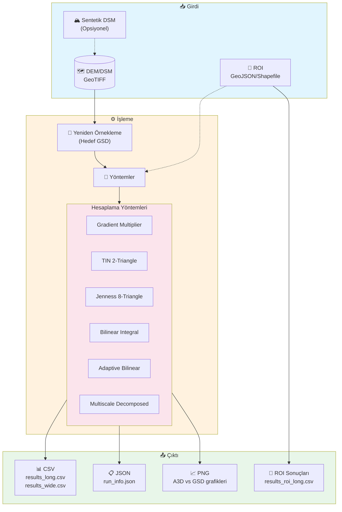
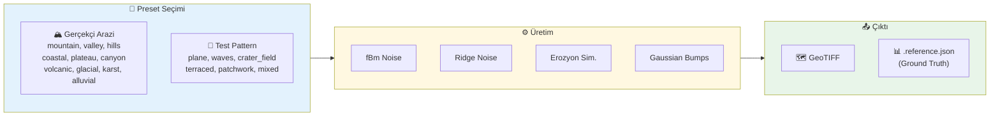

<p align="center">
  
</p>

<h1 align="center">DEM 3D Yüzey Alanı Hesaplama Aracı</h1>

<p align="center">
  <strong>DEM/DSM GeoTIFF verilerinden 3D yüzey alanı (A3D) hesaplama için kapsamlı Python kütüphanesi</strong>
</p>

<p align="center">
  <a href="https://www.python.org/"></a>
  <a href="#lisans"></a>
  <a href="#"></a>
</p>

<p align="center">
  <a href="#-hızlı-başlangıç">Hızlı Başlangıç</a> •
  <a href="#-özellikler">Özellikler</a> •
  <a href="#-kurulum">Kurulum</a> •
  <a href="#-kullanım">Kullanım</a> •
  <a href="#-yöntemler">Yöntemler</a> •
  <a href="#-çıktılar">Çıktılar</a>
</p>

---

## 📋 İçindekiler

- [🚀 Hızlı Başlangıç](#-hızlı-başlangıç)
- [✨ Özellikler](#-özellikler)
- [� İş Akışı](#-iş-akışı)
- [📦 Kurulum](#-kurulum)
- [💻 Kullanım](#-kullanım)
- [⚙️ Parametreler](#️-parametreler)
- [🔬 Yöntemler](#-yöntemler)
- [📊 Çıktılar](#-çıktılar)
- [🧪 Testler](#-testler)
- [⚡ Performans İpuçları](#-performans-ipuçları)
- [📚 Kaynaklar](#-kaynaklar)

---

## 🚀 Hızlı Başlangıç

```bash
# 1. Klonla ve kur
git clone <repo-url>
cd yuzey_alani_hesaplama
pip install -r requirements.txt

# 2. Çalıştır
python main.py run --dem dem_dosyam.tif --outdir sonuclar
```

<details>
<summary>💡 <strong>Detaylı örnek komutlar</strong></summary>

```bash
# Çoklu GSD ve yöntemlerle analiz
python main.py run \
  --dem dag_dsm.tif \
  --outdir out \
  --gsd 0.5 1 2 5 10 \
  --methods gradient_multiplier tin_2tri_cell jenness_window_8tri \
  --plots

# Sentetik DSM ile test
python -m surface_area synth --out test.tif --preset mountain --rows 512 --cols 512
python -m surface_area run --dem test.tif --outdir out_test --gsd 1 2 5 --plots
```

</details>

---

## ✨ Özellikler

<table>
<tr>
<td width="50%">

### 🎯 Hesaplama
- **6 farklı algoritma** ile yüzey alanı hesaplama
- **Çoklu çözünürlük analizi** (GSD desteği)
- **Multiscale ayrıştırma** (topo + mikro)
- **ROI/Parsel desteği** (GeoJSON/Shapefile)

</td>
<td width="50%">

### 📈 Çıktılar
- **CSV** formatında sonuçlar (long + wide)
- **JSON** metadata ve run bilgisi
- **PNG** grafikler (A3D vs GSD, ratio vb.)
- **Ground truth** referans değerler

</td>
</tr>
<tr>
<td>

### ⚡ Performans
- **Blok işleme** ile büyük dosya desteği
- **Bellek-etkin** raster işleme
- **Nodata yönetimi** ve kenar kontrolü

</td>
<td>

### 🛠️ Sentetik DSM
- **16 farklı preset** (10 gerçekçi arazi + 6 test pattern)
- **fBm noise** tabanlı gerçekçi arazi üretimi
- **Erozyon simülasyonu** (hidrolik + termal)
- **Ground truth** referans alan hesaplama

</td>
</tr>
</table>

---

## 🔄 İş Akışı



### Sentetik DSM Üretim Akışı



---

## 📦 Kurulum

### Gereksinimler

| Gereksinim | Minimum | Önerilen |
|:----------:|:-------:|:--------:|
| 🐍 **Python** | 3.10 | 3.12 |
| 💾 **RAM** | 4 GB | 8+ GB |
| 💿 **Disk** | 100 MB | Veri boyutuna bağlı |
| 🖥️ **OS** | Win 10, Ubuntu 20.04+, macOS 11+ | - |

### Adım Adım Kurulum

#### 1️⃣ Repository'yi Klonlayın

```bash
git clone <repo-url>
cd yuzey_alani_hesaplama
```

#### 2️⃣ Sanal Ortam Oluşturun

<details>
<summary>🪟 <strong>Windows (PowerShell)</strong></summary>

```powershell
python -m venv .venv
.venv\Scripts\Activate.ps1

# ExecutionPolicy hatası için:
# Set-ExecutionPolicy -ExecutionPolicy RemoteSigned -Scope CurrentUser
```

</details>

<details>
<summary>🪟 <strong>Windows (CMD)</strong></summary>

```cmd
python -m venv .venv
.venv\Scripts\activate.bat
```

</details>

<details>
<summary>🐧 <strong>Linux / macOS</strong></summary>

```bash
python3 -m venv .venv
source .venv/bin/activate
```

</details>

#### 3️⃣ Bağımlılıkları Yükleyin

```bash
pip install --upgrade pip
pip install -r requirements.txt
```

#### 4️⃣ Kurulumu Doğrulayın

```bash
python -c "import surface_area; print(f'surface_area v{surface_area.__version__}')"
python main.py --help
```

### Bağımlılıklar

| Paket | Amaç |
|:-----:|:-----|
| `numpy` | Sayısal hesaplamalar |
| `rasterio` | GeoTIFF I/O |
| `scipy` | Gaussian filtre, erozyon simülasyonu |
| `pandas` | CSV export |
| `matplotlib` | Grafikler |
| `shapely` | ROI işlemleri |
| `pytest` | Test (geliştirme) |

<details>
<summary>🔴 <strong>Kurulum Sorun Giderme</strong></summary>

**Windows'ta rasterio hatası:**
```powershell
conda install -c conda-forge rasterio
# veya
pip install --find-links=https://github.com/cgohlke/geospatial-wheels/releases rasterio
```

**Permission hatası (Linux/macOS):**
```bash
pip install --user -r requirements.txt
```

**SSL/Network hatası:**
```bash
pip install --trusted-host pypi.org --trusted-host files.pythonhosted.org -r requirements.txt
```

</details>

---

## 💻 Kullanım

### Yöntem 1: IDE Üzerinden (Önerilen)

`main.py` içindeki `DEFAULT_RUN_CONFIG` alanını düzenleyin:

```python
DEFAULT_RUN_CONFIG = RunConfig(
    dem="vadi_dsm.tif",
    outdir="out_vadi",
    gsd=[0.5, 1, 2, 5, 10],
    methods=["gradient_multiplier"],
    plots=True,
)
```

```bash
python main.py
```

### Yöntem 2: Komut Satırı

```bash
python main.py run \
  --dem dag_dsm.tif \
  --outdir out \
  --gsd 0.5 1 2 5 10 \
  --methods gradient_multiplier tin_2tri_cell \
  --plots
```

### Sentetik DSM Üretimi

#### 🗺️ Preset'ler

| Kategori | Preset'ler | Açıklama |
|:--------:|:----------|:---------|
| **Gerçekçi Arazi** | `mountain` | Dağlık arazi (fBm + sırtlar) |
| | `valley` | Vadi ve akarsu yatakları |
| | `hills` | Yumuşak tepeler (rolling hills) |
| | `coastal` | Kıyı şeridi (deniz-kara geçişi) |
| | `plateau` | Yüksek plato ve yamaçlar |
| | `canyon` | Kanyon/boğaz yapıları |
| | `volcanic` | Volkanik arazi (kraterler) |
| | `glacial` | Buzul vadisi (U-şekilli) |
| | `karst` | Karstik arazi (düdenler) |
| | `alluvial` | Alüvyal ova/delta |
| **Test Pattern** | `plane` | Düz eğimli yüzey |
| | `waves` | Sinüzoidal dalgalar |
| | `crater_field` | Krater alanı |
| | `terraced` | Teraslı arazi |
| | `patchwork` | Karışık yüzeyler |
| | `mixed` | Maksimum çeşitlilik |

#### Hızlı Üretim

```bash
python -m surface_area synth \
  --out synthetic.tif \
  --preset mountain \
  --rows 1024 --cols 1024 \
  --dx 1 --seed 42
```

#### Ground Truth (Referans Alan)

```bash
python generate_synthetic_tif.py \
  --out synth_mountain.tif \
  --preset mountain \
  --rows 2048 --cols 2048 \
  --dx 1 --seed 42

# Çıktı: synth_mountain.reference.json
# İçerik: surface_area_m2, planar_area_m2, surface_ratio
```

#### Önemli Parametreler

| Parametre | Açıklama |
|:---------:|:---------|
| `--dx`, `--dy` | Piksel boyutu (metre) |
| `--relief` | Makro rölyef çarpanı |
| `--roughness_m` | Mikro pürüzlülük genliği |
| `--seed` | Tekrarlanabilirlik için sabit seed |
| `--nodata_holes` | Nodata delikleri sayısı |

---

## ⚙️ Parametreler

### Zorunlu Parametreler

| Parametre | Tip | Açıklama |
|:---------:|:---:|:---------|
| `--dem` | `str` | Girdi DEM/DSM GeoTIFF dosya yolu |
| `--outdir` | `str` | Çıktı dizini |

### İsteğe Bağlı Parametreler

<details>
<summary>📏 <strong>GSD (Ground Sample Distance)</strong></summary>

| Değer | Kullanım |
|:-----:|:---------|
| `< 1` | Mikro-topografya, detaylı analiz |
| `1-5` | Standart DEM analizi |
| `5-20` | Bölgesel analiz |
| `> 20` | Geniş alan, trend görme |

```bash
--gsd 0.5 1 2 5 10
```

> ⚠️ Kaynak DEM'den küçük GSD değerleri upsample yapar.

</details>

<details>
<summary>🔄 <strong>Resampling</strong></summary>

| Değer | Açıklama |
|:-----:|:---------|
| `bilinear` | **Varsayılan**, çoğu durum için ideal |
| `nearest` | Kategorik veriler |
| `cubic` | Yumuşak geçişler |

</details>

<details>
<summary>📐 <strong>Slope Method</strong></summary>

| Kernel | Açıklama |
|:------:|:---------|
| `horn` | 3x3 ağırlıklı ortalama, gürültüye dayanıklı |
| `zt` | 4 komşu basit fark, daha hızlı |

</details>

<details>
<summary>🎯 <strong>ROI (Region of Interest)</strong></summary>

```bash
# Mask modu (hızlı)
--roi parcels.geojson --roi_mode mask

# Fraction modu (hassas)
--roi parcels.geojson --roi_mode fraction
```

</details>

---

## 🔬 Yöntemler

### Karşılaştırma Tablosu

| Yöntem | Hız | Doğruluk | Açıklama |
|:-------|:---:|:--------:|:---------|
| `gradient_multiplier` | ⚡⚡⚡ | Yüksek | Gradient tabanlı alan çarpanı |
| `tin_2tri_cell` | ⚡⚡ | Yüksek | Her hücre 2 üçgen |
| `jenness_window_8tri` | ⚡⚡ | Çok yüksek | 3x3 pencerede 8 üçgen |
| `bilinear_patch_integral` | ⚡ | En yüksek | Bilinear yüzey integrasyonu |
| `adaptive_bilinear_patch_integral` | ⚡ | En yüksek | Adaptif bilinear integral |
| `multiscale_decomposed_area` | ⚡ | Özel | Topo + mikro ayrıştırma |

### Yöntem Detayları

<details>
<summary>📐 <strong>1. Jenness Window 8-Triangle</strong></summary>

3x3 komşuluk penceresinde merkez hücre etrafında **8 üçgen** oluşturur.

```
  NW --- N --- NE
   |  \  |  /  |
   |   \ | /   |
  W ----[C]---- E
   |   / | \   |
   |  /  |  \  |
  SW --- S --- SE
```

**Formül:** `A_cell = weight × Σ(Heron üçgen alanları)`

</details>

<details>
<summary>📐 <strong>2. TIN 2-Triangle Cell</strong></summary>

Her hücreyi **2 üçgen** olarak modeller.

```
  p00 -------- p10
   |  \        |
   |    \      |    △1: p00-p10-p11
   |      \    |    △2: p00-p11-p01
   |        \  |
  p01 -------- p11
```

</details>

<details>
<summary>📐 <strong>3. Gradient Multiplier</strong></summary>

```
A_cell = dx × dy × √(1 + p² + q²)
p = ∂z/∂x,  q = ∂z/∂y
```

</details>

<details>
<summary>📐 <strong>4. Bilinear Patch Integral</strong></summary>

Her hücreyi **bilinear yüzey** olarak modeller ve NxN alt bölme ile sayısal integrasyon yapar.

```
z(u,v) = (1-u)(1-v)×z00 + u(1-v)×z10 + (1-u)v×z01 + uv×z11
```

</details>

<details>
<summary>📐 <strong>5. Adaptive Bilinear</strong></summary>

Tolerans kontrollü adaptif refinement:
- Düz alanlar: düşük seviye, hızlı
- Engebeli alanlar: daha fazla inceltme

</details>

<details>
<summary>📐 <strong>6. Multiscale Decomposed</strong></summary>

**Gaussian filtre** ile topo + mikro ayrıştırma:

```
A_total = A_topo + A_micro
```

</details>

---

## 📊 Çıktılar

### CSV Dosyaları

| Dosya | Açıklama |
|:------|:---------|
| `results_long.csv` | Her satır bir (GSD, method) kombinasyonu |
| `results_wide.csv` | Pivot tablo formatı |
| `results_roi_long.csv` | ROI bazlı sonuçlar |

**Kolonlar:** `gsd_m`, `dx`, `dy`, `method`, `A2D`, `A3D`, `ratio`, `valid_cells`, `runtime_sec`

### Metadata

**`run_info.json`** - DEM bilgisi, versiyon, parametreler

### Grafikler (`--plots`)

| Grafik | Açıklama |
|:-------|:---------|
| `A3D_vs_GSD.png` | 3D yüzey alanı vs GSD |
| `ratio_vs_GSD.png` | A3D/A2D oranı vs GSD |
| `micro_ratio_vs_GSD.png` | Mikro oran vs GSD |

---

##  Proje Yapısı

```
yuzey_alani_hesaplama/
├── 📂 surface_area/
│   ├── __init__.py          # Paket tanımı, v0.1.0
│   ├── __main__.py           # Entry point
│   ├── cli.py                # Komut satırı arayüzü
│   ├── io.py                 # Raster I/O, blok işleme
│   ├── methods.py            # 6 hesaplama algoritması
│   ├── multiscale.py         # Gaussian ayrıştırma
│   ├── plotting.py           # PNG grafik üretimi
│   ├── progress.py           # İlerleme çubuğu
│   ├── roi.py                # ROI mask/fraction
│   └── synthetic.py          # Sentetik DSM üretimi
│                             # (fBm, ridge, erozyon)
├── 📂 tests/
│   ├── conftest.py
│   ├── test_synthetic.py
│   ├── test_cli_synth.py
│   ├── test_generate_synthetic_tif_script.py
│   └── test_adaptive_and_roi.py
├── generate_synthetic_tif.py  # Ground truth üretici
├── main.py                    # Ana çalıştırma dosyası
├── requirements.txt
└── README.md
```

---

## 🧪 Testler

```bash
# Tüm testler
pytest -q

# Detaylı çıktı
pytest -v

# Coverage raporu
pytest --cov=surface_area --cov-report=html
```

### Test Yüzeyleri

| Yüzey | Formül | Tolerans |
|:------|:-------|:--------:|
| Plane | z = ax + by + c | < 0.1% |
| Sinusoid | z = A×sin(kx×x)×sin(ky×y) | < 5% |
| Paraboloid | z = (x² + y²) / scale | < 5% |

---

## ⚡ Performans İpuçları

| 💡 İpucu | Açıklama |
|:---------|:---------|
| **Büyük DEM'ler** | Önce kaba GSD'lerle (2-50m) test edin |
| **Hızlı sonuç** | Sadece `gradient_multiplier` kullanın |
| **Bellek** | `--keep_resampled` kapalı tutun |
| **Multiscale** | `--sigma_mode mult` daha tutarlı |

---

## 📜 Sürüm Geçmişi

### v0.1.0

- ✅ 6 yüzey alanı hesaplama yöntemi
- ✅ 16 sentetik DSM preset'i (10 gerçekçi + 6 test)
- ✅ fBm, ridge, turbulence noise üretici
- ✅ Hidrolik ve termal erozyon simülasyonu
- ✅ Ground truth referans alan hesaplama
- ✅ ROI (GeoJSON/Shapefile) desteği
- ✅ Multiscale ayrıştırma
- ✅ CSV/JSON/PNG çıktıları

---

## 📚 Kaynaklar

- Jenness, J. S. (2004). *Calculating landscape surface area from digital elevation models.* Wildlife Society Bulletin, 32(3), 829-839.
- Horn, B. K. (1981). *Hill shading and the reflectance map.* Proceedings of the IEEE, 69(1), 14-47.
- Zevenbergen, L. W., & Thorne, C. R. (1987). *Quantitative analysis of land surface topography.* Earth Surface Processes and Landforms, 12(1), 47-56.

---

## 📄 Lisans

Bu proje açık kaynak olarak sunulmaktadır.

---

## 🤝 Katkıda Bulunma

1. 🍴 Fork edin
2. 🌿 Branch oluşturun (`git checkout -b feature/yenilik`)
3. 💾 Commit edin (`git commit -m 'Yeni özellik'`)
4. 📤 Push edin (`git push origin feature/yenilik`)
5. 🔃 Pull Request açın

---

## 💬 Destek

Sorularınız için issue açabilirsiniz.

---

<p align="center">
  Made with ❤️ for GIS and Remote Sensing
</p>
